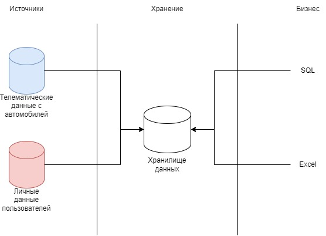

## 1. Архитектура Аналитического Решения
Необходимо нарисовать верхнеуровневую архитектуру аналитического решения по примеру теоретического видео, где я рассказывал об архитектуре ламоды. Необходимо использовать:
- Source Layer - слой источников данных
- Storage Layer - слой хранения данных 
- Business Layer - слой для доступа к данным бизнес пользователей

Результат:

## 2. Аналитика в Excel
Используя данные Sample - Superstore.xls сделать:
- Использовать Lookup
- Построить Сводную таблицу
- Построить примеры отчетов
- Создать дашборд
- И другая функциональность Excel на ваш выбор.

